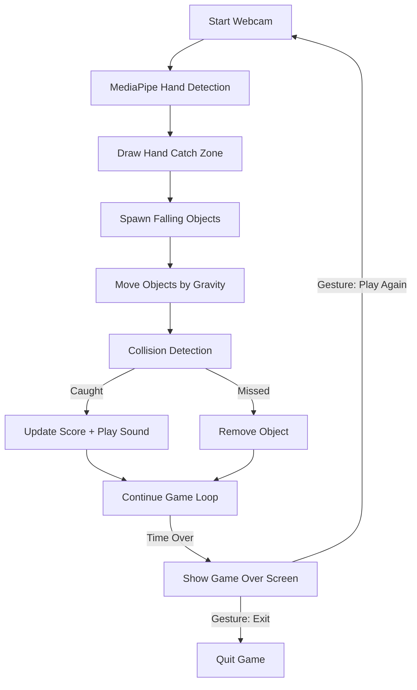

# 🪔 Hand-Tracking Diwali Game (MediaPipe + OpenCV + Pygame)

Celebrate **Diwali** with this fun and interactive **AI-based hand-controlled game** built entirely using **Python**, **OpenCV**, **MediaPipe**, and **Pygame**.  
Use your **hands via webcam** to catch **Diyas (lamps)** and **Sweets**, while avoiding **Firecrackers 💣**, all tracked in real-time using AI-powered hand detection — no keyboard or mouse required!

---

## 🧩 Overview

This project combines **computer vision**, **AI hand tracking**, and **simple game physics** to create a fun Diwali-themed experience.  
MediaPipe detects hand landmarks, OpenCV handles visuals, and Pygame powers sound and timing.

You move your hand in front of the webcam to catch falling objects:
- 🪔 **Diyas** → earn +10 points  
- 🍬 **Sweets** → earn +25 points  
- 💣 **Firecrackers** → lose 15 points  

When the timer ends, a **Game Over** screen appears where you can **restart** or **exit** using hand gestures (hover and close your palm).

---

## ⚙️ Features

- 🖐️ Real-time **hand tracking** using MediaPipe (runs fully on CPU)  
- 🎮 **Gesture-based control** — play without any buttons  
- 🔊 **Sound effects and background music**  
- 💫 Smooth animations and physics-based falling objects  
- 🧠 Customizable difficulty via parameters (gravity, spawn rate, etc.)  
- 🧰 Lightweight — works on most standard laptops  

---

## 🧱 Project Structure

```
yt_diwaligame/
│
├── diya_checker.py           # Main game script
│
├── images/                   # Game assets (PNG with transparency)
│   ├── lamp.png
│   ├── sweet.png
│   ├── firecracker.png
│   └── burst.png
│
├── sounds/                   # Sound effects & background music
│   ├── lamp.wav
│   ├── sweet.wav
│   ├── cracker.wav
│   ├── background.mp3
│   └── game_over.mp3
│
└── README.md                 # Project documentation (this file)
```

---

## 🧰 Installation & Setup

### 1. Clone the Repository
```bash
git clone https://github.com/BLUERAY94/yt_diwaligame.git
cd yt_diwaligame
```

### 2. Install Required Libraries
Make sure you have Python 3.8+ installed. Then run:
```bash
pip install opencv-python mediapipe pygame numpy
```

### 3. Verify Asset Folders
Ensure the following directories exist:
```
images/
    lamp.png
    sweet.png
    firecracker.png
    burst.png

sounds/
    lamp.wav
    sweet.wav
    cracker.wav
    background.mp3
    game_over.mp3
```

---

## 🎥 Webcam Setup

By default, the script uses your primary webcam:
```python
cap = cv2.VideoCapture(0)
```

If you have multiple webcams, you can switch by changing the index:
```python
cap = cv2.VideoCapture(1)
```

To list available cameras:
```python
import cv2
for i in range(5):
    cap = cv2.VideoCapture(i)
    if cap.isOpened():
        print(f"Camera {i} is available")
        cap.release()
```

---

## ▶️ How to Run

Run the game directly:
```bash
python diya_checker.py
```

Once the game starts:
- Move your hand to **catch Diyas 🪔 and Sweets 🍬**
- Avoid **Firecrackers 💣**
- After the timer ends, use **hand gestures** to select **Play Again** or **Exit**

---

## 🧠 How the Game Works

1. **Hand Detection (MediaPipe):**  
   - Detects 21 landmarks per hand.
   - Calculates the hand’s **center** and **radius**.
   - A circle is drawn around the detected hand to act as the “catch zone”.

2. **Object Movement (Physics):**  
   - Randomly spawns objects (Diyas, Sweets, Firecrackers).
   - Each frame updates object positions using gravity and horizontal drift.

3. **Collision Detection:**  
   - The object’s center is compared to the hand circle.
   - If the distance is within the sum of radii, it’s caught.
   - Based on object type:
     - Diya → +10 points  
     - Sweet → +25 points  
     - Firecracker → -15 points (with explosion sound)

4. **End Game & Gestures:**  
   - When time runs out, you can **close your palm** over “Play Again” or “Exit”.
   - The game restarts or closes based on your gesture.

---

## ⚙️ Configurable Parameters

You can modify these variables at the top of `diya_checker.py`:

| Variable | Description | Default |
|-----------|-------------|----------|
| `GAME_TIME` | Total game duration (seconds) | `50` |
| `START_SPAWN_INTERVAL` | Initial spawn interval (sec) | `1.0` |
| `MIN_SPAWN_INTERVAL` | Minimum interval at max difficulty | `0.3` |
| `START_GRAVITY` | Starting fall speed | `2` |
| `MAX_GRAVITY` | Maximum fall speed | `8` |
| `DIYA_SCORE` | Points per diya | `10` |
| `SWEET_SCORE` | Points per sweet | `25` |
| `FIRECRACKER_PENALTY` | Points lost on firecracker | `15` |
| `OBJECT_SIZE` | Object image size (pixels) | `80` |
| `CATCH_RADIUS` | Maximum hand catch radius | `100` |

---

## 🔊 Sound & Visual Feedback

| File | Trigger | Description |
|------|----------|-------------|
| `lamp.wav` | Catch diya | Reward sound |
| `sweet.wav` | Catch sweet | Bonus sound |
| `cracker.wav` | Catch firecracker | Explosion |
| `background.mp3` | During game | Background music |
| `game_over.mp3` | After time ends | Game Over screen |

---

## 🖐️ MediaPipe Hand Tracking Details

MediaPipe Hands provides **21 keypoints** for each detected hand:

```
0: WRIST
1–4: THUMB (CMC → TIP)
5–8: INDEX (MCP → TIP)
9–12: MIDDLE (MCP → TIP)
13–16: RING (MCP → TIP)
17–20: PINKY (MCP → TIP)
```

To find the **catch zone**:
- Compute the average `(x, y)` of all landmarks → hand center  
- Compute standard deviation → hand spread radius  
- Draw a circle with capped radius (`CATCH_RADIUS`)

This circle is used to check if any falling object overlaps with the hand.

---

## 💡 Game Flow Diagram



---

## 🚀 Future Improvements

- Multi-hand scoring system  
- Level progression with increasing speed  
- High-score saving to JSON or database  
- Visual UI with animated effects  
- Optional difficulty selector  

---

## 🙌 Credits

- **MediaPipe** by Google – Hand landmark tracking  
- **OpenCV** – Frame rendering and display  
- **Pygame** – Audio playback and timing  
- Developed by **Ajeeth (BLUERAY94)**  

---

## 🎆 Happy Diwali! 🎇

Catch Diyas and sweets, avoid firecrackers, and enjoy a tech-powered Diwali celebration!  
✨ May your code — and your festival — shine bright!
